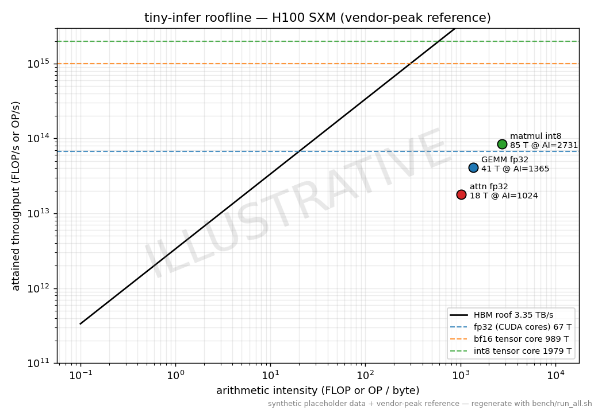

# tiny-infer

Hand-written CUDA kernels for transformer inference, benchmarked against cuBLAS
and PyTorch — with a CPU correctness suite that validates the kernel algorithms
on any machine (no GPU required to verify the math).

Three kernels, each built up through an explicit optimization ladder and
documented:

| Kernel | What it is | Source | Design notes |
|---|---|---|---|
| **Tiled SGEMM** | block + register tiling, shared-memory staging, `float4` loads, transposed `A` tile | [`gemm_tiled.cu`](src/cuda/gemm_tiled.cu) | [docs](docs/kernels/gemm.md) |
| **Fused attention** | FlashAttention-1 forward; online softmax, `S` never materialized | [`attention_fused.cu`](src/cuda/attention_fused.cu) | [docs](docs/kernels/attention.md) |
| **INT8 matmul** | W8A8, per-row × per-channel scales, `__dp4a` int32 accumulation | [`quant_int8_matmul.cu`](src/cuda/quant_int8_matmul.cu) | [docs](docs/kernels/quant.md) |

---

## ⚠️ Status & provenance of the numbers

This repo was authored in a **CPU-only environment**, so the performance numbers
below and in `docs/` are **ILLUSTRATIVE placeholders** — plausible-magnitude
guesses, watermarked `ILLUSTRATIVE`, *not* measurements. What is **real and
verified today**:

- ✅ The three CUDA kernels (compile with `nvcc` via CMake).
- ✅ CPU reference implementations + a **17-check correctness suite** that runs
  in CI and validates the kernel algorithms — including the FlashAttention
  online-softmax recurrence (matches the textbook softmax to ~`1e-7`).
- ✅ The full benchmark + profiling + plotting pipeline.

To produce **real** numbers, run on a GPU:

```bash
bash bench/run_all.sh        # builds kernels, runs correctness-gated benches,
                             # rewrites data/results.csv, regenerates figures
```

That deletes the synthetic `data/results.csv` and repopulates it from the
benchmarks (which **verify each kernel against the CPU reference before
timing**). See [`docs/methodology.md`](docs/methodology.md).

## Headline results (ILLUSTRATIVE placeholders)

FP32 GEMM — **% of cuBLAS achieved** and PyTorch-eager comparison:

| Shape | tiny-infer | cuBLAS | **% of cuBLAS** |
|---|---|---|---|
| 4096³ | 38.0 TFLOP/s | 49.0 TFLOP/s | **77.6%** |
| 8192³ | 41.0 TFLOP/s | 52.0 TFLOP/s | **78.8%** |

Fused attention (dim 64, causal) — decode steps/sec vs PyTorch SDPA (FA-2):

| Context | tiny-infer | PyTorch SDPA |
|---|---|---|
| 2048 | 34k tok/s | 45k tok/s |
| 4096 | 16k tok/s | 21k tok/s |

INT8 matmul — `__dp4a` vs cuBLAS tensor-core int8 (the gap motivates an
`mma.sync` path):

| Shape | tiny-infer | cuBLAS TC | % of cuBLAS |
|---|---|---|---|
| 4096³ | 78 TOP/s | 620 TOP/s | 12.6% |

Full tables, figures, and the roofline: [`docs/results/results.md`](docs/results/results.md).



## Quick start

**Verify the kernels' math (no GPU needed):**

```bash
make test          # builds + runs the CPU correctness suite (17 checks)
```

**Build + run on a GPU:**

```bash
make cuda                    # cmake -DTINY_INFER_BUILD_CUDA=ON
bash bench/run_all.sh        # benchmark everything, regenerate results + figures
bash scripts/profile_ncu.sh  # capture Nsight Compute profiles into docs/profiles/
```

**Regenerate figures from the CSV (CPU):**

```bash
make plots         # or: python scripts/plot_results.py && python scripts/roofline.py
```

## Layout

```
include/tiny_infer/   public headers (CPU refs always; CUDA launchers behind TI_WITH_CUDA)
src/cpu/              CPU reference implementations (correctness ground truth)
src/cuda/             the three CUDA kernels + cuda_utils.cuh
tests/                CPU correctness suite (no GPU) — runs in CI
bench/                cuBLAS/PyTorch benchmark harness + run_all.sh
scripts/              roofline.py, plot_results.py, profile_ncu.sh
docs/                 methodology, per-kernel design notes, results, profiles
data/results.csv      benchmark data (ILLUSTRATIVE until a real run overwrites it)
```

## Requirements

- **CPU suite:** a C++17 compiler (`g++`/`clang++`) — that's it.
- **CUDA build:** CUDA Toolkit 12.x (`nvcc`, cuBLAS), CMake ≥ 3.18, an NVIDIA
  GPU. Default target arches: `sm_80/86/89/90` (Ampere → Hopper).
- **Plots / PyTorch baseline:** `pip install -r requirements.txt`; a CUDA
  PyTorch build for the eager baselines (skipped gracefully if absent).

## License

MIT — see [LICENSE](LICENSE).
