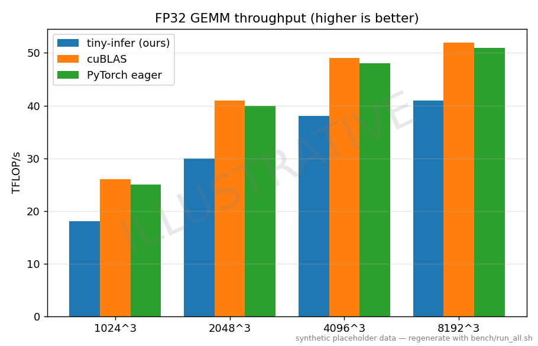
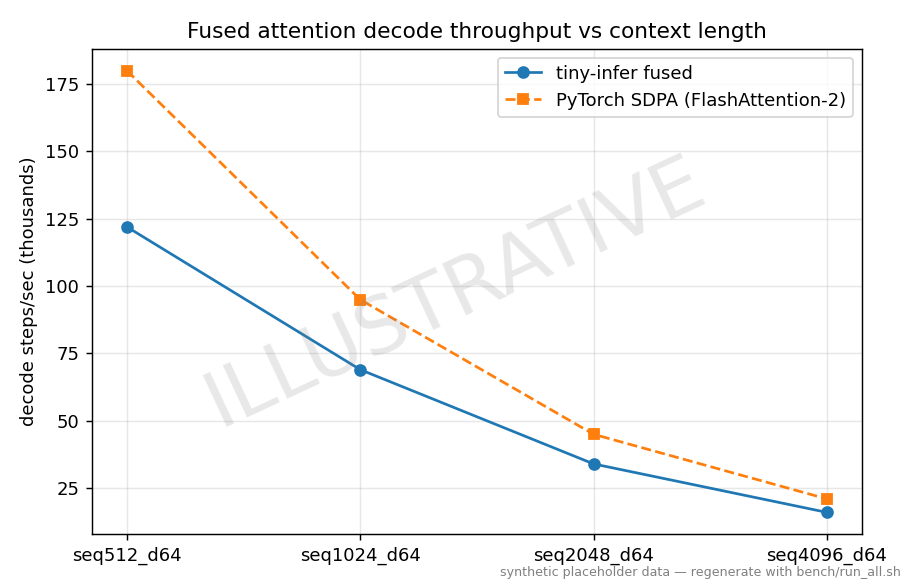
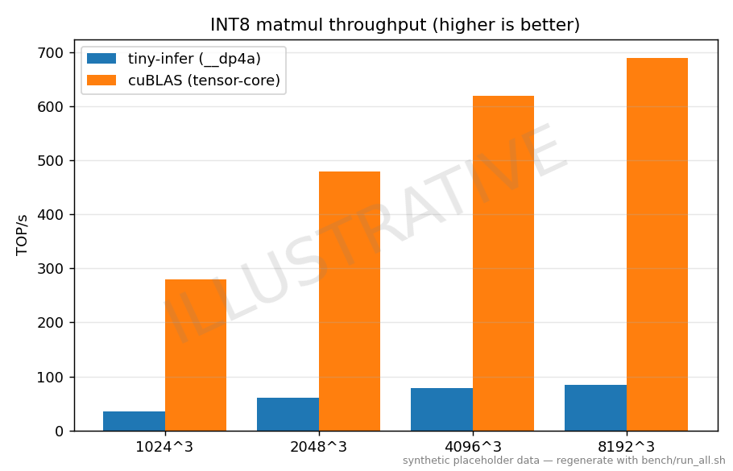

# Results

> ⚠️ **ILLUSTRATIVE / SYNTHETIC — NOT MEASURED.** Every number below is a
> placeholder generated from `data/results.csv` (which carries a synthetic-data
> banner) to show the intended layout. Regenerate real measurements with
> `bash bench/run_all.sh` on a GPU, then refresh this file. The figures are
> watermarked `ILLUSTRATIVE` until then.

**Run metadata (fill in for real runs):** GPU `____` · driver `____` · CUDA
`____` · cuBLAS `____` · PyTorch `____` · clocks `____`.

## FP32 GEMM vs cuBLAS

| Shape | tiny-infer (TFLOP/s) | cuBLAS (TFLOP/s) | % of cuBLAS | PyTorch eager (TFLOP/s) | max rel err |
|---|---|---|---|---|---|
| 1024³ | 18.0 | 26.0 | 69.2% | 25.0 | 3.1e-4 |
| 2048³ | 30.0 | 41.0 | 73.2% | 40.0 | 3.2e-4 |
| 4096³ | 38.0 | 49.0 | 77.6% | 48.0 | 3.3e-4 |
| 8192³ | 41.0 | 52.0 | 78.8% | 51.0 | 3.3e-4 |

## Fused attention (FlashAttention-1) vs PyTorch SDPA

dim = 64, causal. `tokens/sec` = single-query decode steps per second at the
given context length.

| Context (seq) | tiny-infer (k tok/s) | PyTorch SDPA / FA-2 (k tok/s) | GFLOP/s (ours) | max rel err |
|---|---|---|---|---|
| 512 | 122 | 180 | 8200 | 6.0e-4 |
| 1024 | 69 | 95 | 12500 | 6.1e-4 |
| 2048 | 34 | 45 | 16000 | 6.2e-4 |
| 4096 | 16 | 21 | 18000 | 6.2e-4 |

## INT8 matmul vs cuBLAS (tensor-core int8)

| Shape | tiny-infer `__dp4a` (TOP/s) | cuBLAS TC (TOP/s) | % of cuBLAS | Frobenius rel err |
|---|---|---|---|---|
| 1024³ | 35 | 280 | 12.5% | 5.5e-3 |
| 2048³ | 60 | 480 | 12.5% | 5.5e-3 |
| 4096³ | 78 | 620 | 12.6% | 5.5e-3 |
| 8192³ | 85 | 690 | 12.3% | 5.5e-3 |

The ~12% reflects `__dp4a` (INT32 ALU pipe) vs cuBLAS's int8 **tensor cores** —
see [`kernels/quant.md`](../kernels/quant.md) for why, and the `mma.sync` next
step that closes it.

## Roofline

All three kernels sit in the compute-bound region at the swept sizes; the
vertical gap from each point to its ceiling is the remaining headroom (most
visible for int8, motivating the tensor-core path).
