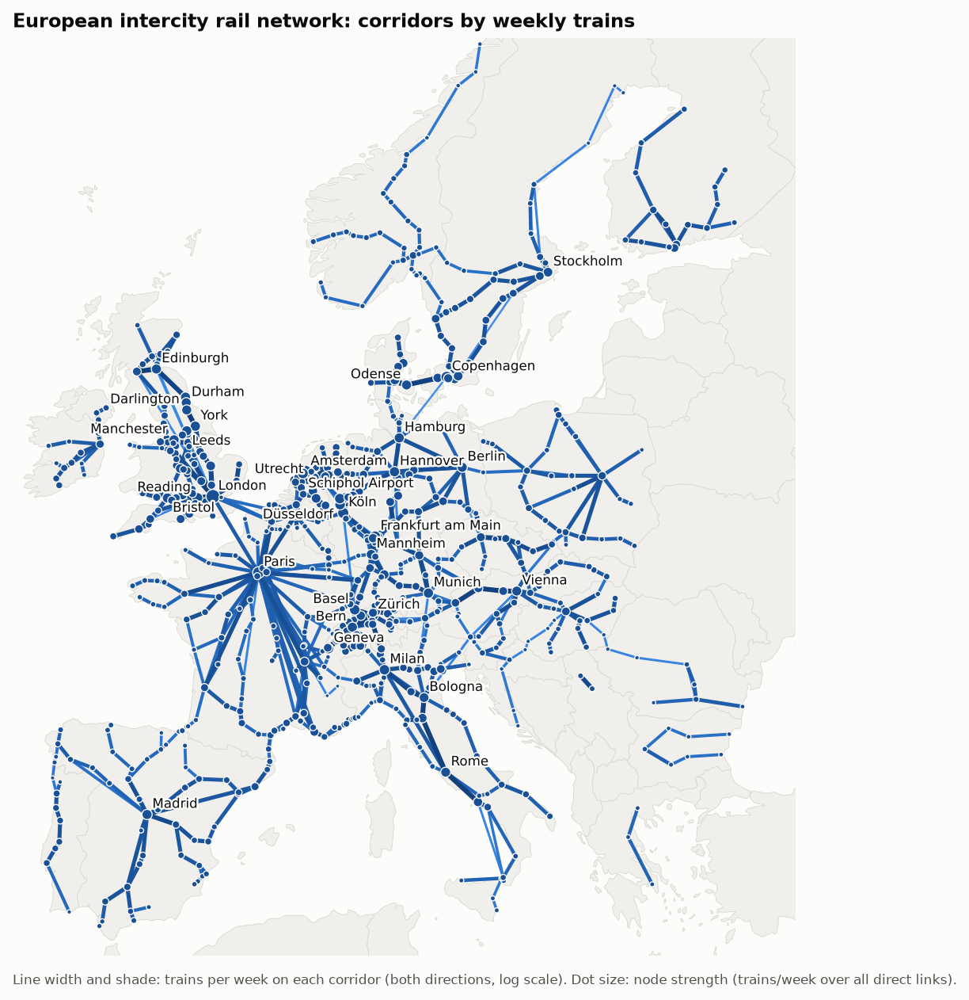
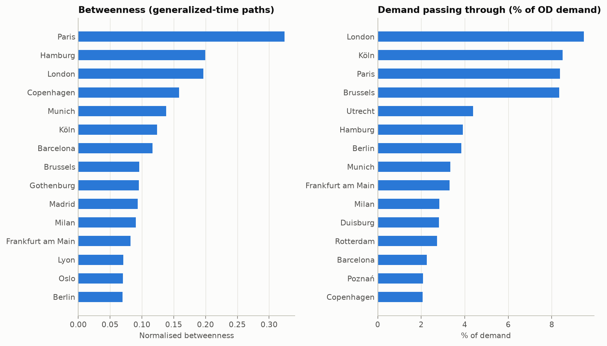
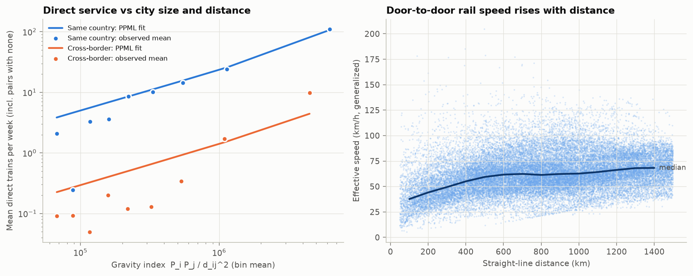
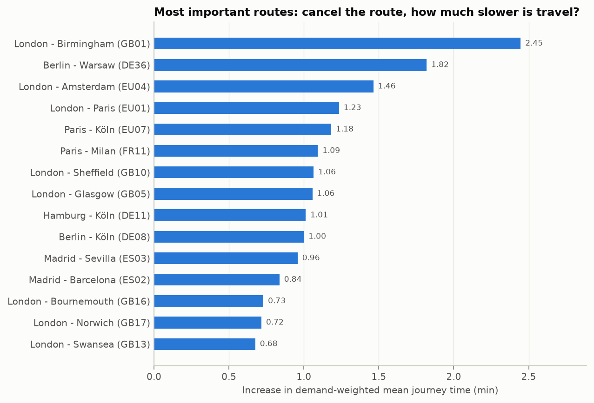
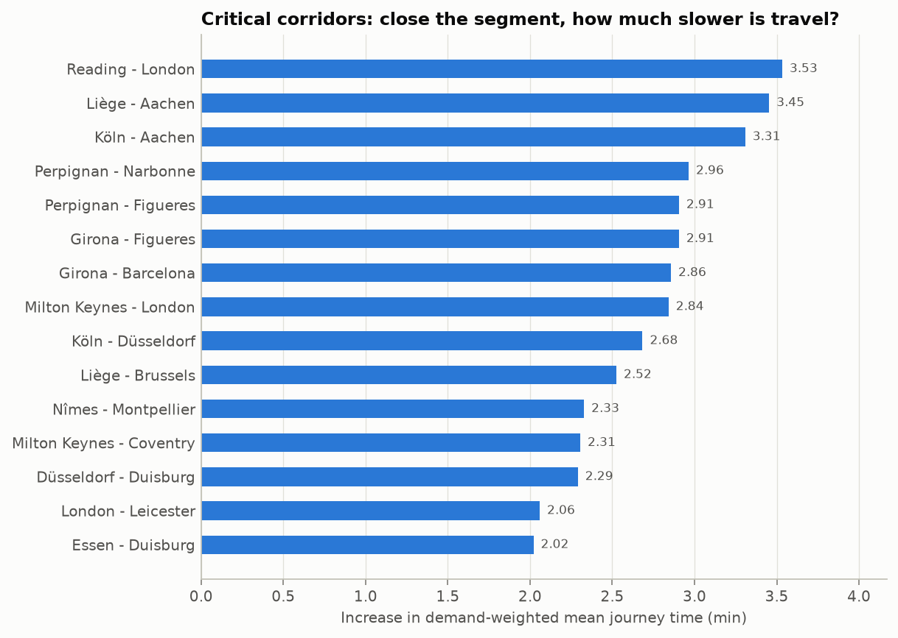
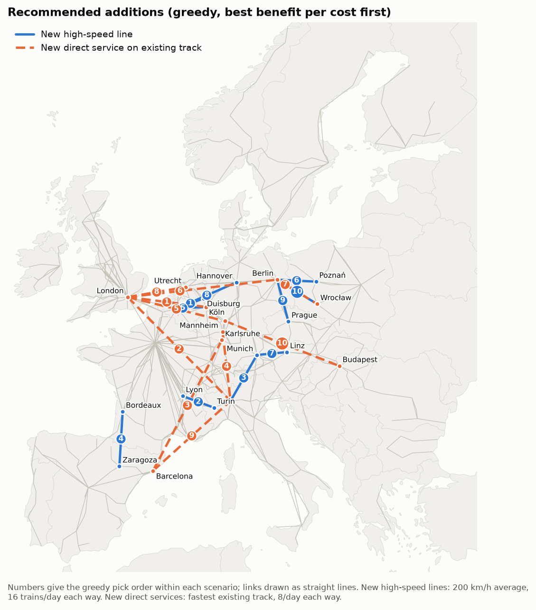
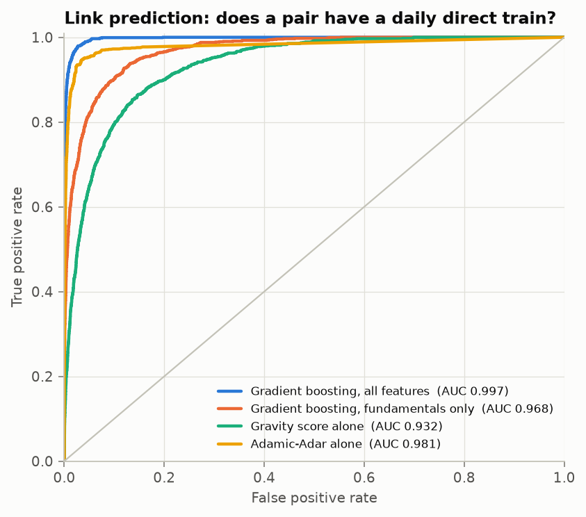

# Network Analysis for European Intercity Rail — Project Report

**Team:** Jeremy Kovacs (jkovacs), Po-Chun Wu (pochunw), Johnson Tsai (chiungct)

> **Read this first — what the numbers are.** Every number and figure in this report was computed by the
> pipeline in this folder on a **hand-compiled, approximate demo network** (310 intercity, high-speed and
> night-train lines; 715 stations; 12,416 weekly trips; `data/demo/lines.txt`). The official GTFS portals
> (gtfs.de, SNCF, Renfe, Mobility Database) were not reachable from the environment the project was built
> in, so the demo encodes the main 2024–26 services from general knowledge of published timetables, with
> run times rounded and frequencies approximate. The **methods, code and tests are final**; the
> **numbers are a demonstration** and must be regenerated from official timetables before they are quoted
> (`PYTHONPATH=src python -m eurail download && PYTHONPATH=src python -m eurail all`, see §8). `results/RESULTS.md` is regenerated
> automatically on every run.

---

## 1. Overview and goals

Trains are a primary means of intercity transport in Europe. We model the network as a graph —
**nodes are cities/stations, edges are direct train links, weights are trains per week** — and use it to
answer three questions from our proposal:

1. **Connectivity.** How connected are pairs of cities, and how does that relate to their distance and
   populations?
2. **Importance.** Which routes and corridors matter most to the network?
3. **Improvement.** Which new routes — new high-speed lines, or new direct trains on existing track —
   would be most beneficial? Can an algorithm (or a machine-learning model) predict them?

## 2. Data and network construction

### 2.1 Sources

| Data | Source | Notes |
|---|---|---|
| Timetables | GTFS feeds (`config/feeds.toml`: DB long-distance via gtfs.de, SNCF, Renfe, NS, SBB, ÖBB, Trenitalia, PKP IC) | **Demo run:** approximate hand-compiled feed in the same GTFS format |
| City population and coordinates | GeoNames (offline copy bundled with `geonamescache`) | 34k places ≥ 15k inhabitants; ≥ 1k for small-station lookup |
| Map / coastline | Natural Earth 1:50m (via the `world-atlas` package) | Map background and the sea-crossing check |

### 2.2 From timetables to a graph

1. **Ingest** (`gtfs.py`). Keep rail routes (GTFS `route_type` 2 and the extended 100-series, filterable
   per feed to intercity categories). For each trip, count the days it runs in a reference week, using
   `calendar.txt` plus `calendar_dates.txt` exceptions. The reference week defaults to the busiest of the
   feed's first eight weeks, to avoid holiday timetables. Handle times after midnight (`25:10:00`) and
   interpolate untimed stops.
2. **Merge stations into cities** (`cities.py`). Platforms fold into their parent station. Each station
   then joins the **most populous city whose catchment covers it**; the catchment radius grows with
   population, `4.5 km × (pop/100k)^0.4`, clipped to 3–15 km. On the demo this merges London's
   7 termini, Paris's 6, and Brussels' and Vienna's 3 each into single nodes. Out-of-town high-speed
   stations (Marne-la-Vallée, Valence TGV, Frankfurt Airport) stay separate, as they are genuinely
   different places, and airport stations are never folded into a city.
3. **Two graphs on the same nodes** (`graph.py`):
   * **Service graph** — every pair of stops on the same train is linked (a TGV Paris → Lyon →
     Marseille links all three pairs, exactly as in our proposal). A path of *k* edges means *k*
     trains, i.e. *k − 1* changes.
   * **Segment graph** — only consecutive stops, approximating the physical corridors.

   Edges carry trains/week (both directions), weekly-weighted median and minimum travel time, and
   distance. A cross-border train published in two operators' feeds is counted once.

**Demo network:** 671 nodes (592 cities), 3,187 service edges, 879 segment edges.



### 2.3 Measuring "how good is the connection": generalized travel time

Raw hop counts ignore frequency and speed, so every analysis uses a **generalized journey time**:

```
riding one service edge = median in-vehicle time
                        + expected wait  = min(half the headway over a 16 h day, 60 min)
                        + 15 min transfer penalty (per boarding; the first boarding is refunded)
```

A frequent, fast link is therefore "short", and every change costs extra, as it does for real
travellers. To weigh city pairs we use a **gravity demand model**, `W_ij ∝ P_i P_j / d_ij²`, between the
315 cities ≥ 100k inhabitants, for pairs ≥ 100 km apart (the usual threshold for long-distance travel).
Each pair's rail time is capped by a **road alternative** (30 min + 1.25 × distance at 80 km/h), so a pair
without useful rail service counts as a road trip rather than an arbitrary infinite penalty. The headline
metric is the **demand-weighted mean generalized journey time**; lower is better.

## 3. Network structure

| Metric | Service graph | Segment graph |
|---|---|---|
| Nodes / edges | 671 / 3,187 | 671 / 879 |
| Mean degree (max) | 9.5 (114, Paris) | 2.6 (32) |
| Average clustering | 0.83 | 0.11 |
| Connected components | 6 (main: 93.4% of nodes) | 6 |
| Mean shortest path (main component) | **3.97 trains** | 11.4 segments |
| Diameter (main component) | 12 trains | 48 segments |

* **High clustering is a property of how trains work.** Every train creates a clique of all its stops, so
  the service graph's clustering (0.83) is far above the segment graph's (0.11). A typical pair of
  stations is about 4 trains (3 changes) apart.
* **Components.** Apart from the continental network, which includes Great Britain via the Channel
  Tunnel, the demo network has five separate intercity networks: the island of Ireland, Finland,
  Bulgaria, Greece and Serbia. In the demo data they have no scheduled intercity link to the main
  network (real timetables have a few thin cross-border services).
* **Degree distribution** (`results/figures/degree_distribution.png`) is heavy-tailed. A handful of
  capitals and junctions have 50–114 direct destinations (Paris, London, Munich, Frankfurt, Berlin,
  Milan), while the median node has 7 and 70% of nodes have fewer than 10.

### 3.1 Hubs



* **Paris has by far the highest betweenness (0.32).** France's network is radial: TGV lines fan out
  from Paris, so shortest routes between French regions, and between Spain/Italy and the North Sea,
  pass through it.
* **Hamburg (0.20) and Copenhagen (0.16)** rank high because they are the only gateways between
  Scandinavia and the continent. Their betweenness reflects a bottleneck, not size.
* **Demand actually flowing through** a node (the right panel; gravity demand assigned to fastest
  paths) is highest at **London, Köln, Paris and Brussels** (8–9.5% of all OD demand each). The
  **London – Brussels – Köln axis carries the most assigned demand of any links in the network.**
* **Accessibility** (`results/figures/accessibility_map.png`, demand-weighted mean journey time to all
  other cities) is best in south-east England and the Benelux–Rhine core. English cities near London
  score 155–210 min; London scores 257, Brussels 259, Köln 277, Frankfurt 286 and Paris 304. The
  periphery is two to four times slower: Madrid 483, Bucharest 709, Palermo 820, Oslo 832, Lisbon 907,
  Helsinki 926, Athens 1,192. The English scores are flattered by London's large GeoNames population
  (see §8).

## 4. RQ1 — Connectivity vs distance and population

For all 36,613 pairs of cities ≥ 100k that lie 50–1,500 km apart (1,165 with a daily direct train) we fit
three gravity models (`gravity.py`, robust standard errors). The PPML estimator is the standard choice when
many pairs have zero flow.

| Model | log(pop_i·pop_j) | log(distance) | same country | fit |
|---|---|---|---|---|
| PPML: direct trains/week | **+0.69** | **−1.31** | **+2.86** (×17.5) | pseudo-R² 0.66 |
| Logit: has a daily direct train | +1.08 | −1.73 | +2.42 (odds ×11.2) | pseudo-R² 0.49 |
| OLS: log generalized journey time | −0.04 | **+0.71** | −0.29 | R² 0.75 |

All coefficients are significant at p < 10⁻¹⁰⁰. Full tables: `results/tables/gravity_coefficients.csv`.



**Findings.**

* **Size and distance.** Direct service grows less than proportionally with city size (elasticity
  0.69) and falls steeply with distance (−1.31). Doubling the distance between two cities cuts the
  expected number of direct trains by 60%.
* **Strong border effect.** A domestic city pair gets **17.5× as many direct trains** as an otherwise
  identical cross-border pair. Among pairs 100–800 km apart, 20.8% of domestic pairs have a daily
  direct train but only 1.7% of cross-border pairs do. Controlling for distance and size, a
  cross-border journey takes about **a third longer** (OLS coefficient −0.29 on domestic pairs,
  e^0.29 ≈ 1.33). This is the rail equivalent of the "border puzzle" in trade
  economics: national operators, signalling and timetabling stop at the border.
* **Long trips are relatively fast.** The journey-time elasticity is 0.71, so doubling the distance
  multiplies the time by only 1.64. Effective door-to-door speed (including waits and changes) rises
  from 38 km/h for 50–150 km pairs to 55 km/h at 300–500 km and 68 km/h at 1,200–1,500 km,
  because long trips use high-speed lines and the fixed penalties are spread over more kilometres.
* **Under-served pairs** (much slower than the model predicts, weighted by demand;
  `results/tables/underserved_pairs.csv`) are almost all **cross-border**: Budapest–Kraków,
  Vienna–Zagreb, Prague–Wrocław, Copenhagen–Berlin, Kraków–Košice, Copenhagen–Szczecin. These are
  pairs of large cities under 350 km apart that need 2–4 trains.

## 5. RQ2 — Which routes and corridors matter most?

We run **knock-out experiments** (`importance.py`) and measure how much the demand-weighted mean journey
time rises:

* **Cancel a route:** remove every trip of one line.
* **Close a segment:** every train over that stretch of track is cut in two, so all journeys across it
  are lost. This is the scenario of a flood, a tunnel closure or a strike.



**Most important routes** (+ minutes of mean journey time when cancelled): London–Birmingham (West Coast
Main Line, +2.4), Berlin–Warsaw EuroCity (+1.8), Eurostar London–Amsterdam (+1.5), Eurostar London–Paris
(+1.2), Paris–Köln (+1.2), Paris–Milan (+1.1). The pattern: the most valuable routes are
**international links with no alternative of similar quality**, and trunk lines out of the largest
city.



**Most critical segments.** Three corridor families dominate the top 15
(`results/figures/critical_corridors_map.png`):

1. **Brussels – Liège – Aachen – Köln** (#2, #3, #10). This is the single high-speed link from
   France/Benelux/Britain into Germany. Closing Liège–Aachen alone adds 3.5 min to the European mean
   and makes rail lose to road for 2.5% of all demand.
2. **Narbonne – Perpignan – Figueres – Girona – Barcelona** (#4–#7). This is the only standard-gauge
   rail link between Spain and France; every Spain–France direct train uses it.
3. **The London approaches** (Reading–London #1, Milton Keynes–London #8) and the **Rhine-Ruhr
   trunk** (Köln–Düsseldorf–Duisburg–Essen). These are the busiest pieces of track in the network, where
   one closure delays hundreds of trains a week.

**Real-world meaning.** These are single points of failure. Resilience spending — diversionary routes,
spare capacity, rapid-repair plans — has the highest value exactly where a corridor is both busy and
without an alternative. Multi-month line closures such as those after the July 2021 floods in western
Germany are exactly the scenario these experiments measure.

## 6. RQ3 — Which new routes would help most?

### 6.1 Algorithm: greedy budgeted network design

Let *R* be the matrix of shortest generalized costs between cities. Adding one new direct link (u, v)
with cost *c* changes it **exactly** to

```
R'_ij = min( R_ij ,  R_iu + c + R_vj ,  R_iv + c + R_uj )
```

because a shortest path with positive costs uses a new edge at most once. So every candidate can be scored
without re-running Dijkstra, and any candidate with `c ≥ R_uv` is pruned (it cannot shorten any path).
The unit tests check the exact update against a full recomputation. The **greedy algorithm**
(`recommend.py`) repeatedly adds the candidate with the largest *reduction in demand-weighted mean journey
time per unit cost*, updates *R*, and repeats. Greedy ratio selection is the standard heuristic for
budgeted network-design problems. There are two scenarios:

| Scenario | Candidates | New link | Cost |
|---|---|---|---|
| **New high-speed line** | 4,265 pairs of cities ≥ 200k, 150–800 km | 200 km/h average over 1.2 × straight-line distance; 16 trains/day each way | €25M/km on land + €150M/km for the part over sea (tunnels/bridges) |
| **New direct service** on existing track | 5,234 pairs with no direct train today | fastest existing track path; 8 trains/day each way | train-km per day (operating cost) |



**Greedy high-speed plan** (`results/tables/hsr_greedy_plan.csv`):

| # | New line | Cost (bn €) | Gain (min) | Closest real-world project |
|---|---|---|---|---|
| 1 | Brussels – Duisburg (Ruhr) | 5.4 | 3.1 | Upgrades of the Brussels–Aachen–Rhine-Ruhr axis |
| 2 | Lyon – Turin | 7.0 | 2.2 | **Lyon–Turin base tunnel** (under construction) |
| 3 | Munich – Milan | 10.4 | 2.8 | **Brenner Base Tunnel** + approaches (under construction) |
| 4 | Bordeaux – Zaragoza | 10.6 | 2.5 | Western Pyrenees crossings (GPSO / Basque Y; proposed Pau–Canfranc–Zaragoza reopening) |
| 5 | Brussels – Köln | 5.5 | 1.0 | Aachen–Köln upgrade |
| 6 | Berlin – Poznań | 7.2 | 1.3 | Berlin–Warsaw corridor / Polish HSR plans |
| 7 | Linz – Munich | 6.1 | 1.0 | Munich–Mühldorf–Salzburg (ABS 38) and Austrian Westbahn upgrades |
| 8 | Brussels – Hannover | 12.2 | 1.9 | — |
| 9 | Berlin – Prague | 8.4 | 1.3 | **Dresden–Prague high-speed line** (planned) |
| 10 | Berlin – Wrocław | 8.8 | 1.2 | — |

The ten lines cost about **€82bn** and cut the demand-weighted mean journey time by **18.2 min (5.1%)**,
with diminishing returns (`results/figures/hsr_greedy_curve.png`). **All ten picks cross a border**,
although domestic pairs were equally eligible; this is the border effect of §4 turned into an investment
list. Without being told about any existing plans, the algorithm selects corridors that are on the EU's
TEN-T core network and already have projects (Lyon–Turin, Brenner, Dresden–Prague, Berlin–Warsaw, the
Pyrenees crossings).

**New direct services on existing track** (`results/tables/direct_service_greedy_plan.csv`) are nearly
free to build but gain much less. The first pick, **London–Köln (+2.1 min)**, dominates; London–Frankfurt
and London–Berlin also appear, in line with the London–Germany through trains that Eurostar and DB have
announced plans for. Later picks (London–Milan, Barcelona–Milan, Frankfurt–Budapest) gain ≤ 0.5 min each. Removing
changes matters most where a high-speed tunnel (the Channel Tunnel) already exists but through-service does not.

### 6.2 Machine-learning link prediction

We train classifiers (`linkpred.py`) to predict whether a city pair ≤ 1,200 km apart has a daily direct
train (29,329 pairs, 1,233 positive). Features:
- **exogenous:** distance, populations, same country;
- **infrastructure:** fastest track time on the segment graph;
- **topological:** common neighbours, Jaccard, Adamic-Adar, resource allocation, degree product.

Topological features are recomputed with each test fold's links removed, so they cannot leak the answer.
Results are from 5-fold cross-validation.

| Model | ROC AUC | Avg. precision |
|---|---|---|
| Gradient boosting, all features | **0.997** | **0.953** |
| Logistic regression, all features | 0.996 | 0.946 |
| Adamic-Adar alone | 0.981 | 0.874 |
| Gradient boosting, fundamentals only (size, distance, border, track) | 0.968 | 0.703 |
| Gravity score alone | 0.932 | 0.468 |



* **Topology alone is very predictive** because the service graph is a union of cliques: if a train
  links A–B and B–C, it usually also links A–C. The interesting comparison is **fundamentals vs gravity**:
  adding the border dummy and the track time lifts average precision from 0.47 to 0.70.
* **"Missing links"** are pairs the model rates as likely but that have no daily direct train
  (`results/tables/missing_links_*.csv`). On the demo data several of the top ones —
  London–Wolverhampton, Düsseldorf–Karlsruhe, Köln–Karlsruhe, Zürich–Frankfurt, Manchester–Bristol,
  Nantes–Marseille — **do have direct trains in reality** but were left out of our hand-compiled demo. The model found
  gaps in our own data from structure alone, which is good evidence that it learned something real. On
  official timetables the same list becomes a list of genuinely missing services.

## 7. Real-world interpretation and recommendations

1. **Fix the borders first.** The strongest and most consistent signal in every analysis is the border:
   a 17.5× service penalty (§4), cross-border pairs dominate the under-served list, and all 10 greedy
   high-speed picks are cross-border. Timetable coordination and through-running (e.g. London–Köln,
   Copenhagen–Berlin, Prague–Wrocław) need little construction and address this directly.
2. **Protect the chokepoints.** Brussels–Aachen–Köln, Perpignan–Figueres, the London approaches and
   the Rhine-Ruhr trunk are single points of failure with outsized network-wide impact (§5).
3. **Build the missing mountain and sea crossings.** The algorithm's top high-speed picks coincide with
   projects already under way (Lyon–Turin, Brenner, Dresden–Prague). This is independent support for
   them, and a ranking for when budgets are tight.
4. **Hubs are also risks.** Paris's betweenness and the Hamburg/Copenhagen gateway role mean capacity or
   disruption problems there propagate network-wide. Non-radial links (e.g. Lyon–Turin, Bordeaux–Spain)
   reduce this dependence.

## 8. Limitations and how to get final results

* **Demo data (biggest caveat).** Run on official feeds before quoting any number:
  ```bash
  PYTHONPATH=src python -m eurail download     # edit URLs/paths in config/feeds.toml first
  PYTHONPATH=src python -m eurail all          # rebuilds data/processed and results/
  ```
  Some feed URLs are marked `verified = false`; check them on the portals listed there. Country-wide
  feeds (NL, CH) need the `name_regex` filters to keep only intercity trains.
* **Populations** are GeoNames city figures, which are not uniformly defined. London's entry is Greater
  London (9.0M) while Paris's is the city proper (2.1M), which overweights London in the demand model.
  District entries in GeoNames rule out simply summing nearby places; urban-area populations (Eurostat
  FUA/metro regions) would be the fix.
* **Demand is modelled, not observed.** The gravity weights are a proxy; ridership data would change
  magnitudes, not the method. Seat capacity is not in GTFS, so edges are weighted by frequency.
* **Cost model is coarse.** New lines are straight lines (1.2 × detour) with average per-km costs; sea
  crossings are priced but mountains are not. Treat the plan as a ranking, not a budget.
* **Greedy is a heuristic.** Gains can be complementary (two links that only pay off together), which
  greedy selection may miss; an integer program or local search is a natural extension.
* **Other modes** enter only through the road-alternative cap; air competition on 600+ km pairs is not
  modelled.

## 9. Division of labour

We worked on every stage together; the code splits into three workstreams, matching our proposal:

| Workstream | Modules | Key outputs |
|---|---|---|
| **Data → graph** | `gtfs.py`, `cities.py`, `graph.py`, `build.py`, `demo.py`, `config/feeds.toml` | `data/processed/*`, network map |
| **Algorithm / model** | `metrics.py`, `recommend.py`, `linkpred.py` | greedy plans, link-prediction scores |
| **Analysis & interpretation** | `gravity.py`, `importance.py`, `analyze.py`, `plotting.py`, this report | gravity models, knock-outs, figures |

Each module has tests in `tests/` (22 tests, `python -m pytest`) so any team member can change one part
and check it did not break the others.

## 10. Reproducibility

```bash
cd eu-rail-network
pip install -r requirements.txt
PYTHONPATH=src python -m eurail all --demo     # ~4 min; regenerates data/processed/ and results/
python -m pytest
```

All numbers in this report come from `results/summary.json` and `results/tables/*.csv` of that run.
